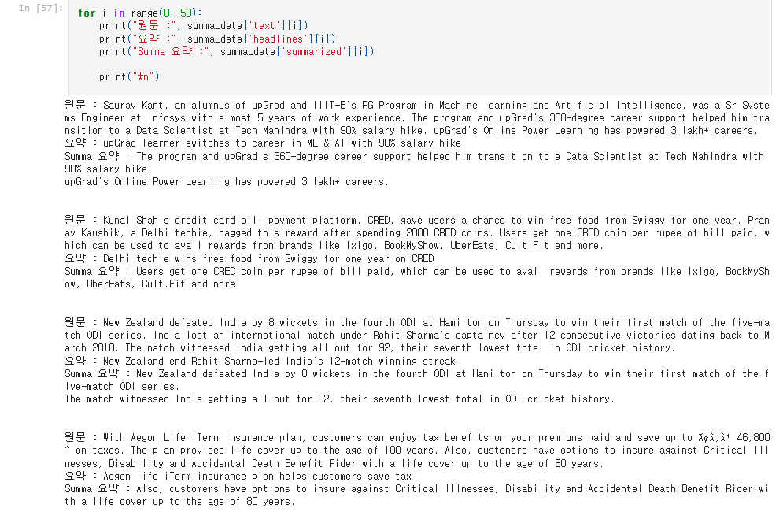
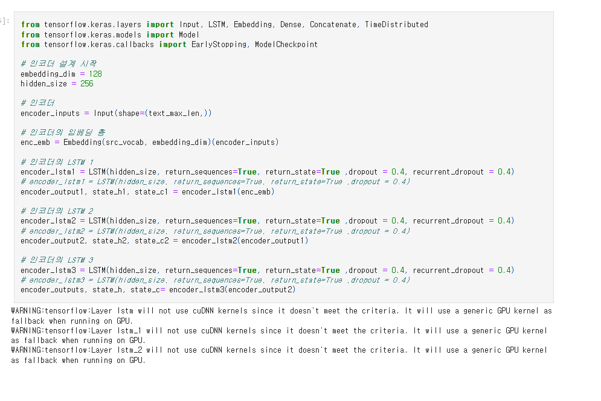
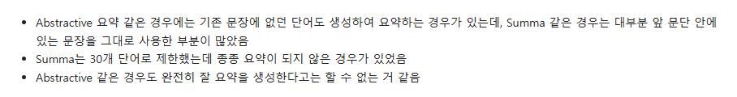
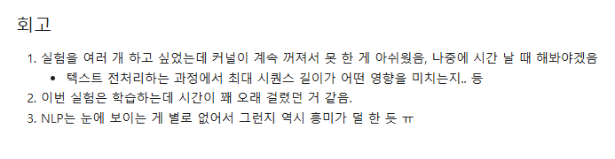
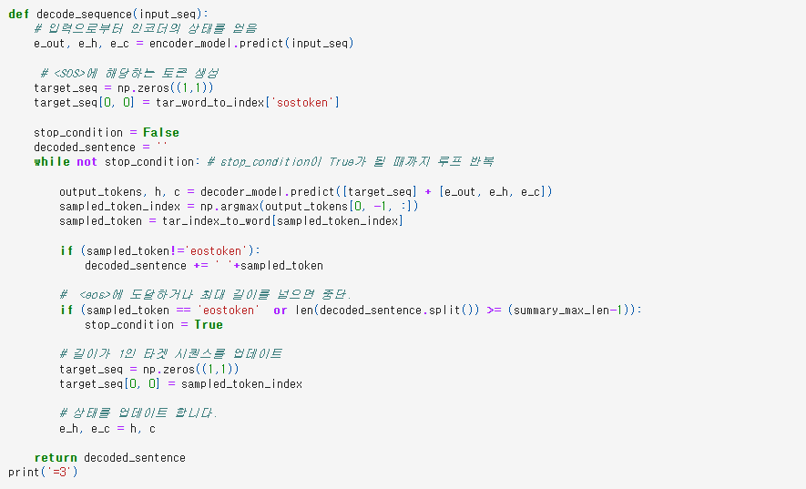

# AIFFEL Campus Online Code Peer Review Templete
- 코더 : 홍예린
- 리뷰어 : 염철헌


# PRT(Peer Review Template)
- [X]  **1. 주어진 문제를 해결하는 완성된 코드가 제출되었나요?**
    - 문제에서 요구하는 최종 결과물이 첨부되었는지 확인
        - 중요! 해당 조건을 만족하는 부분을 캡쳐해 근거로 첨부
        - 추출적 요약 summa와 seq2seq를 활용한 추상적 요약을 수행해서 같이 출력하였음
        - 
    
- [ ]  **2. 전체 코드에서 가장 핵심적이거나 가장 복잡하고 이해하기 어려운 부분에 작성된 
주석 또는 doc string을 보고 해당 코드가 잘 이해되었나요?**
    - 해당 코드 블럭을 왜 핵심적이라고 생각하는지 확인
    - 해당 코드 블럭에 doc string/annotation이 달려 있는지 확인
    - 해당 코드의 기능, 존재 이유, 작동 원리 등을 기술했는지 확인
    - 주석을 보고 코드 이해가 잘 되었는지 확인
        - 중요! 잘 작성되었다고 생각되는 부분을 캡쳐해 근거로 첨부
        - 인코딩 lstm 모델에서 recurrent dropout을 수행한 부분을 각 층 별로 lstm 레이어라고 표기하여 알아볼 수 있었음
        - 
        
- [ ]  **3. 에러가 난 부분을 디버깅하여 문제를 해결한 기록을 남겼거나
새로운 시도 또는 추가 실험을 수행해봤나요?**
    - 문제 원인 및 해결 과정을 잘 기록하였는지 확인
    - 프로젝트 평가 기준에 더해 추가적으로 수행한 나만의 시도, 
    실험이 기록되어 있는지 확인
        - 중요! 잘 작성되었다고 생각되는 부분을 캡쳐해 근거로 첨부
        - 회고 형식으로 summa가 잘 작동하지 않은 것을 캐치하고 기록으로 남겼으며, 첨부하지는 않았으나 피어리뷰 시점에서 개인파일로 추가 실험을 진행한 부분을 보여주었음
        - 
        
- [ ]  **4. 회고를 잘 작성했나요?**
    - 주어진 문제를 해결하는 완성된 코드 내지 프로젝트 결과물에 대해
    배운점과 아쉬운점, 느낀점 등이 기록되어 있는지 확인
    - 전체 코드 실행 플로우를 그래프로 그려서 이해를 돕고 있는지 확인
        - 중요! 잘 작성되었다고 생각되는 부분을 캡쳐해 근거로 첨부
        - recurrent dropout의 이슈로 인해 cuDNN과 CUDA를 활용하지 못해서, 학습 속도가 느리고 커널이 중지되는 점을 기록하였음
        - 
        
- [ ]  **5. 코드가 간결하고 효율적인가요?**
    - 파이썬 스타일 가이드 (PEP8) 를 준수하였는지 확인
    - 코드 중복을 최소화하고 범용적으로 사용할 수 있도록 함수화/모듈화했는지 확인
        - 중요! 잘 작성되었다고 생각되는 부분을 캡쳐해 근거로 첨부
        - 각 모델 구성이 간결하고, 디코딩 과정이 명확함
        - 


# 회고(참고 링크 및 코드 개선)
```
# 학습 노드를 따라가며 모델을 구성하고 실험한 부분이 비슷해 알아보기 명확했습니다.
# recurrent dropout을 수행하면 모델 val_loss가 제 모델보다 감소한다는 것을 확인하였으나, 별개로 인간이 판단했을 때 요약 예측 성능이 매우 안 좋은 것을 보면 이런 추상적 요약 모델에서는 val_loss가 낮은 것이 어떤 의미인지는 아직 잘 모르겠음
```
