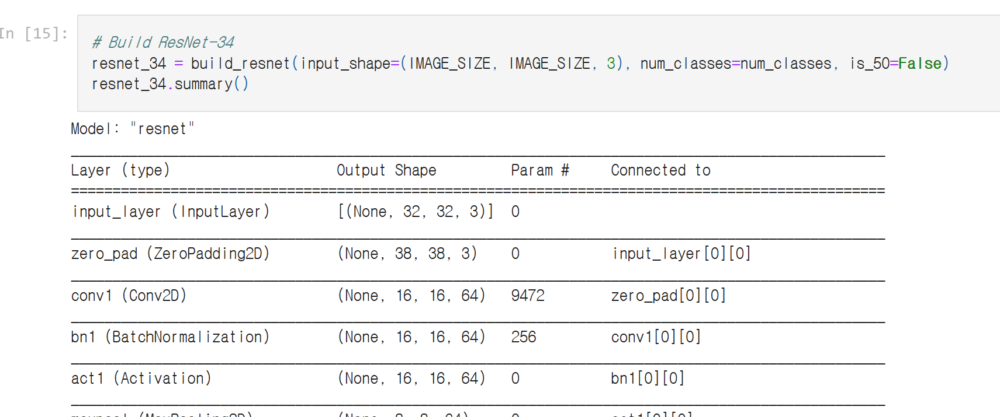
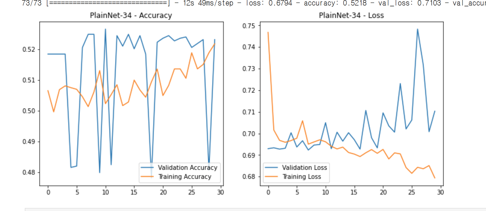
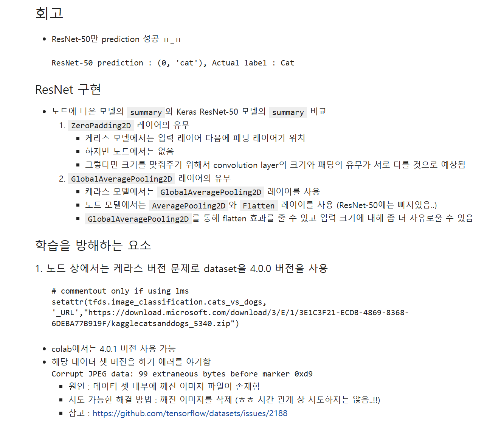

# AIFFEL Campus Online Code Peer Review Templete
- 코더 : 홍예린
- 리뷰어 : 맹성찬


# PRT(Peer Review Template)
- [X]  **1. 주어진 문제를 해결하는 완성된 코드가 제출되었나요?**
    - 문제에서 요구하는 최종 결과물이 첨부되었는지 확인
        - 중요! 해당 조건을 만족하는 부분을 캡쳐해 근거로 첨부
          
          ResNet과 plain_net을 잘 구성했다.
          
          학습이 되는것을 확인할 수 있었다. 하지만, 학습이 제대로 되지 않는 경우가 발생한다고 한다.
          
          프로젝트에서 정확히 요구하는 Ablation Study는 아니지만, 시각적으로 원하는 바를 보여주고 있다.
    
- [X]  **2. 전체 코드에서 가장 핵심적이거나 가장 복잡하고 이해하기 어려운 부분에 작성된 
주석 또는 doc string을 보고 해당 코드가 잘 이해되었나요?**
    - 해당 코드 블럭을 왜 핵심적이라고 생각하는지 확인
    - 해당 코드 블럭에 doc string/annotation이 달려 있는지 확인
    - 해당 코드의 기능, 존재 이유, 작동 원리 등을 기술했는지 확인
    - 주석을 보고 코드 이해가 잘 되었는지 확인
        - 중요! 잘 작성되었다고 생각되는 부분을 캡쳐해 근거로 첨부
          잘 작성되었습니다.
        
- [X]  **3. 에러가 난 부분을 디버깅하여 문제를 해결한 기록을 남겼거나
새로운 시도 또는 추가 실험을 수행해봤나요?**
    - 문제 원인 및 해결 과정을 잘 기록하였는지 확인
    - 프로젝트 평가 기준에 더해 추가적으로 수행한 나만의 시도, 
    실험이 기록되어 있는지 확인
        - 중요! 잘 작성되었다고 생각되는 부분을 캡쳐해 근거로 첨부
          에러는 아니지만, warning이 뜨는 이유와 이를 해결하기 위해 노력했습니다.
        
- [X]  **4. 회고를 잘 작성했나요?**
    - 주어진 문제를 해결하는 완성된 코드 내지 프로젝트 결과물에 대해
    배운점과 아쉬운점, 느낀점 등이 기록되어 있는지 확인
    - 전체 코드 실행 플로우를 그래프로 그려서 이해를 돕고 있는지 확인
        - 중요! 잘 작성되었다고 생각되는 부분을 캡쳐해 근거로 첨부
          회고 잘 작성되었습니다.
          
        
- [X]  **5. 코드가 간결하고 효율적인가요?**
    - 파이썬 스타일 가이드 (PEP8) 를 준수하였는지 확인
    - 코드 중복을 최소화하고 범용적으로 사용할 수 있도록 함수화/모듈화했는지 확인
        - 중요! 잘 작성되었다고 생각되는 부분을 캡쳐해 근거로 첨부
          함수형태로 깔끔하게 작성되었습니다.


# 회고(참고 링크 및 코드 개선)
```
우선 Keras에서 제공하는 ResNet을 불러와 원본을 이해한것이 인상적이였습니다. 좋은 레퍼런스들을 참고해야한다는 것을 다시한번 느낍니다.
모든 코드가 함수형태로 매우 깔끔하고 간결합니다. 보고 배워야겠습니다.
아쉬운점은 프로젝트 노드에서 요구하는 것은 이미지 사이즈가 224,224 였지만, 프로젝트 수행시 32, 32 로 진행했습니다.
고생 많으셨습니다.
```
