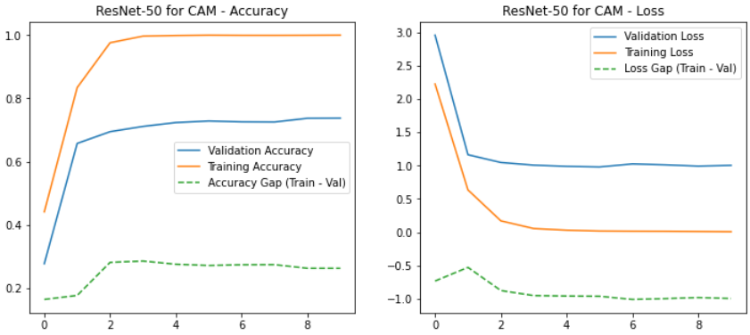
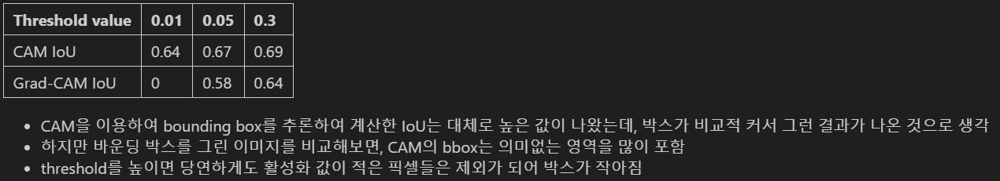
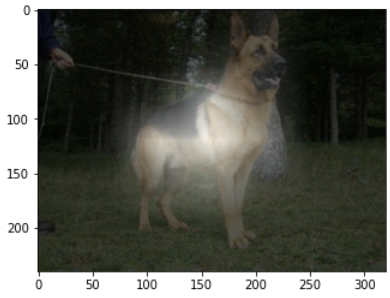
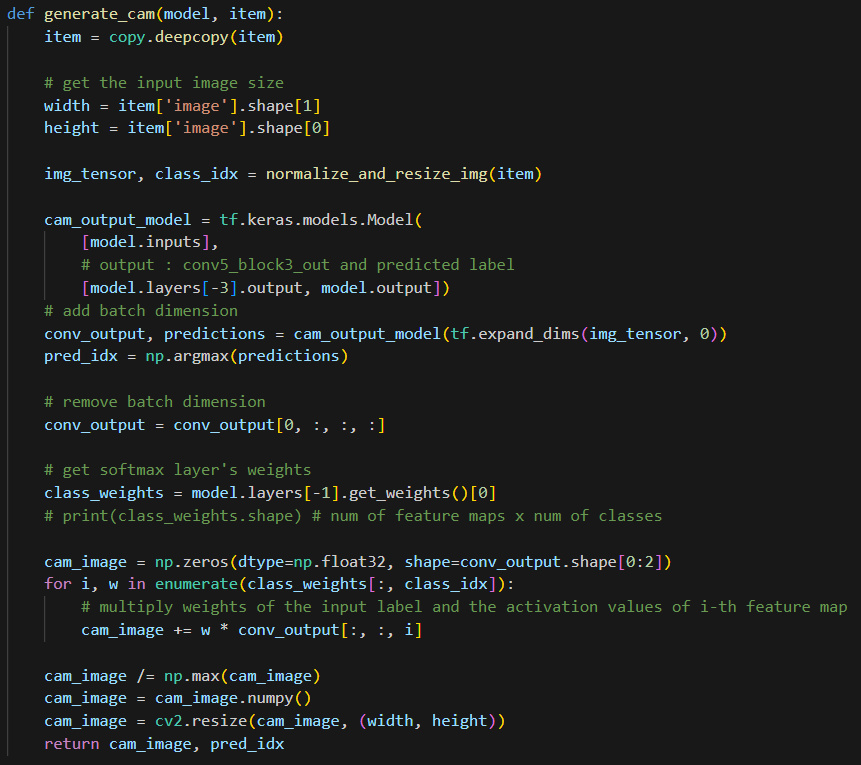
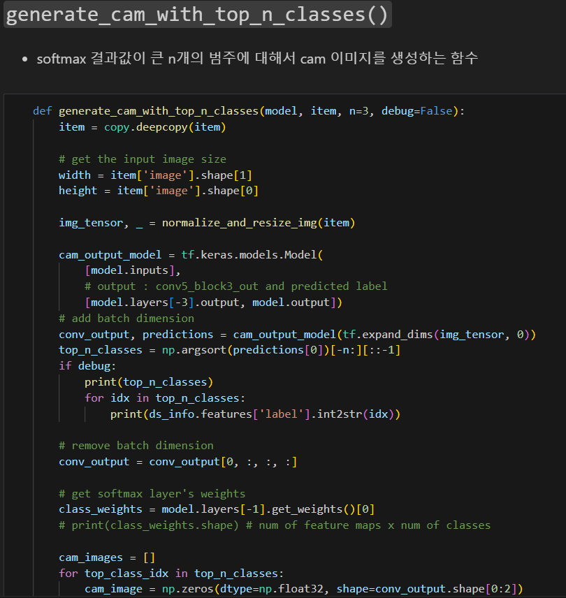
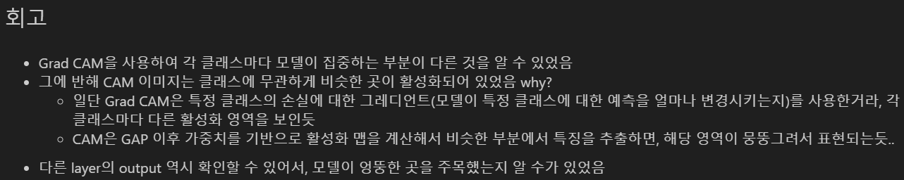
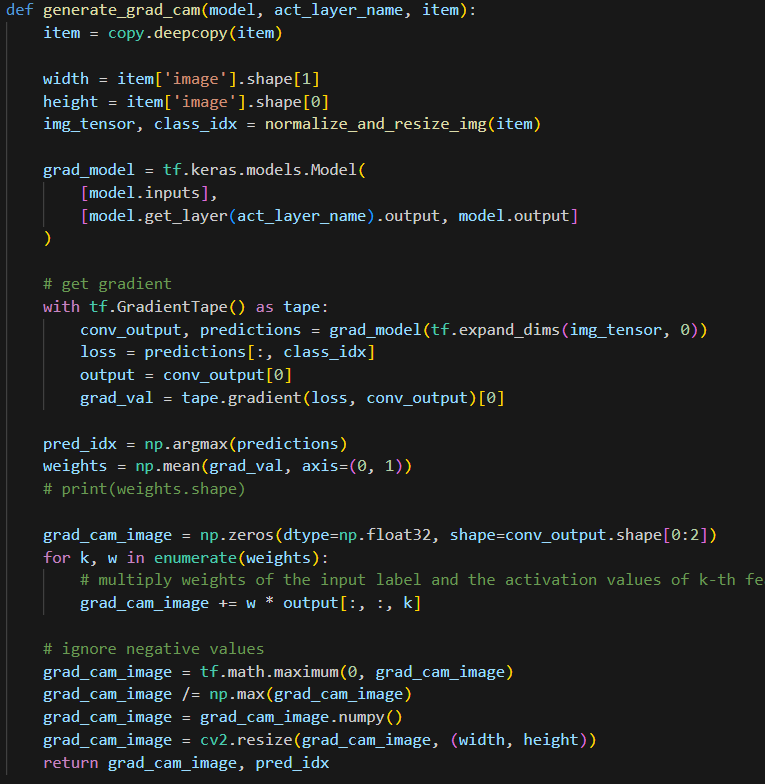

# AIFFEL Campus Online Code Peer Review Templete
- 코더 : 홍예린
- 리뷰어 : 김인수


# PRT(Peer Review Template)
- [X]  **1. 주어진 문제를 해결하는 완성된 코드가 제출되었나요?**
    - 모델이 잘 수렴하였고, CAM 및 GRAD-CAM 비교실험 및 분석을 도출하셨습니다.  
    
    
    

    
- [X]  **2. 전체 코드에서 가장 핵심적이거나 가장 복잡하고 이해하기 어려운 부분에 작성된 
주석 또는 doc string을 보고 해당 코드가 잘 이해되었나요?**
    - 주석이 잘 작성되어 있습니다.      
    

- [X]  **3. 에러가 난 부분을 디버깅하여 문제를 해결한 기록을 남겼거나
새로운 시도 또는 추가 실험을 수행해봤나요?**
    - 추가 실험 기록을 남기셨습니다.  
    

- [X]  **4. 회고를 잘 작성했나요?**
    - 실험별 회고가 잘 작성되어 있습니다.  
    

- [X]  **5. 코드가 간결하고 효율적인가요?**
    - 코드를 잘 작성하셨습니다.  
    

# 회고(참고 링크 및 코드 개선)
```
실험 내용을 짜임새있게 구성하셨고   
추가 실험에서 기존 실험으로 확인할 수 없던 내용도 분석하였습니다.
전체 과정을 잘 수행하셨습니다.
```
