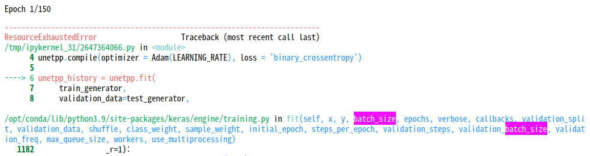

# AIFFEL Campus Online Code Peer Review Templete
- 코더 : 홍예린
- 리뷰어 : 이정우


# PRT(Peer Review Template)
- [ ]  **1. 주어진 문제를 해결하는 완성된 코드가 제출되었나요?**
    - 문제에서 요구하는 최종 결과물이 첨부되었는지 확인
        - 중요! 해당 조건을 만족하는 부분을 캡쳐해 근거로 첨부
     
          

          Unet과 Unet ++ 로 비교되는 실험을 해주셨습니다.

    
- [ ]  **2. 전체 코드에서 가장 핵심적이거나 가장 복잡하고 이해하기 어려운 부분에 작성된 
주석 또는 doc string을 보고 해당 코드가 잘 이해되었나요?**
    - 해당 코드 블럭을 왜 핵심적이라고 생각하는지 확인
    - 해당 코드 블럭에 doc string/annotation이 달려 있는지 확인
    - 해당 코드의 기능, 존재 이유, 작동 원리 등을 기술했는지 확인
    - 주석을 보고 코드 이해가 잘 되었는지 확인
        - 중요! 잘 작성되었다고 생각되는 부분을 캡쳐해 근거로 첨부
     
          

          regulation은 못해봐서 참고가 되었습니다.

        
- [ ]  **3. 에러가 난 부분을 디버깅하여 문제를 해결한 기록을 남겼거나
새로운 시도 또는 추가 실험을 수행해봤나요?**
    - 문제 원인 및 해결 과정을 잘 기록하였는지 확인
    - 프로젝트 평가 기준에 더해 추가적으로 수행한 나만의 시도, 
    실험이 기록되어 있는지 확인
        - 중요! 잘 작성되었다고 생각되는 부분을 캡쳐해 근거로 첨부
     
          배치사이즈를 16으로 줄이는 부분을 기록해 주 셨습니다.

          
        
- [ ]  **4. 회고를 잘 작성했나요?**
    - 주어진 문제를 해결하는 완성된 코드 내지 프로젝트 결과물에 대해
    배운점과 아쉬운점, 느낀점 등이 기록되어 있는지 확인
    - 전체 코드 실행 플로우를 그래프로 그려서 이해를 돕고 있는지 확인
        - 중요! 잘 작성되었다고 생각되는 부분을 캡쳐해 근거로 첨부
     
        - ### 회고
- UNet은 비교적 구현이 쉬웠는데 UNet++는 nested connection이 조금 어려웠음
- 처음에 UNet을 배치 크기 32로 돌렸었는데 UNet++는 OOM 나서 16으로 줄임
    
- 정량적으로 비교가 잘 안 돼서 for loop 안 쓰고 모델을 다시 구현해서 비교 ㅠㅠ
- 정성적으로 보면 테스트에서 두 번째와 세 번째 이미지가 눈에 띄게 비교가 됨  
     
  - 그림자 경계선도 길로 잘 인식이 됨  
     
  - 길쭉해서 가로로 스케일이 작은데도 인식이 됨  
- 정량적으로 IoU 그래프를 그려보았는데, UNet++가 더 높은 성능을 보임

        
- [ ]  **5. 코드가 간결하고 효율적인가요?**
    - 파이썬 스타일 가이드 (PEP8) 를 준수하였는지 확인
    - 코드 중복을 최소화하고 범용적으로 사용할 수 있도록 함수화/모듈화했는지 확인
        - 중요! 잘 작성되었다고 생각되는 부분을 캡쳐해 근거로 첨부
     
        - 


# 회고(참고 링크 및 코드 개선)
```
# 리뷰어의 회고를 작성합니다.
# 코드 리뷰 시 참고한 링크가 있다면 링크와 간략한 설명을 첨부합니다.
저는 뭔가 깔끔하게 안되는 느낌인데 보기도 편하고 이해하기도 편하게 해주셔서 도움이 되었습니다.

# 코드 리뷰를 통해 개선한 코드가 있다면 코드와 간략한 설명을 첨부합니다.
```
